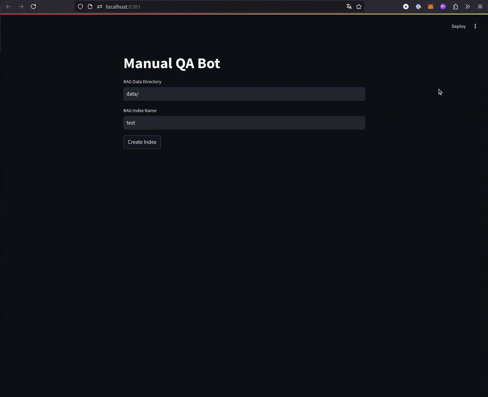

# manual-qa-bot

図の多いマニュアルのような文書に対して、ローカル環境でRAGを用いて質問に答えるボットです。
以下の手法を組み合わせています。

* [Qwen2-VL](https://github.com/QwenLM/Qwen2-VL)
* [ColPali](https://github.com/illuin-tech/colpali)

## Installation

```bash
git clone https://github.com/neka-nat/manual-qa-bot.git
cd manual-qa-bot
uv sync
```

## Run

```bash
uv run streamlit run scripts/run_app.py
```

## Demo

データのダウンロード

```bash
mkdir data
cd data
wget https://info.gbiz.go.jp/about/document/HowTo.pdf
```


